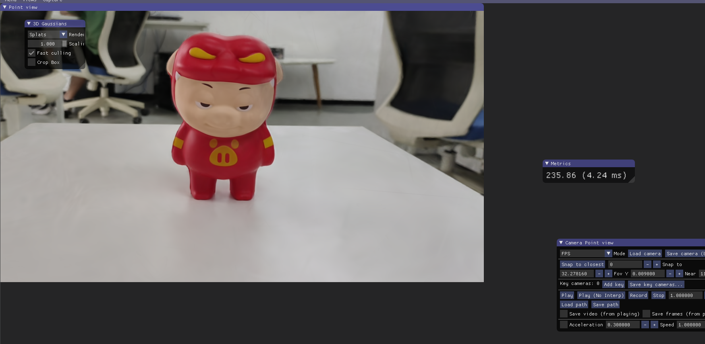
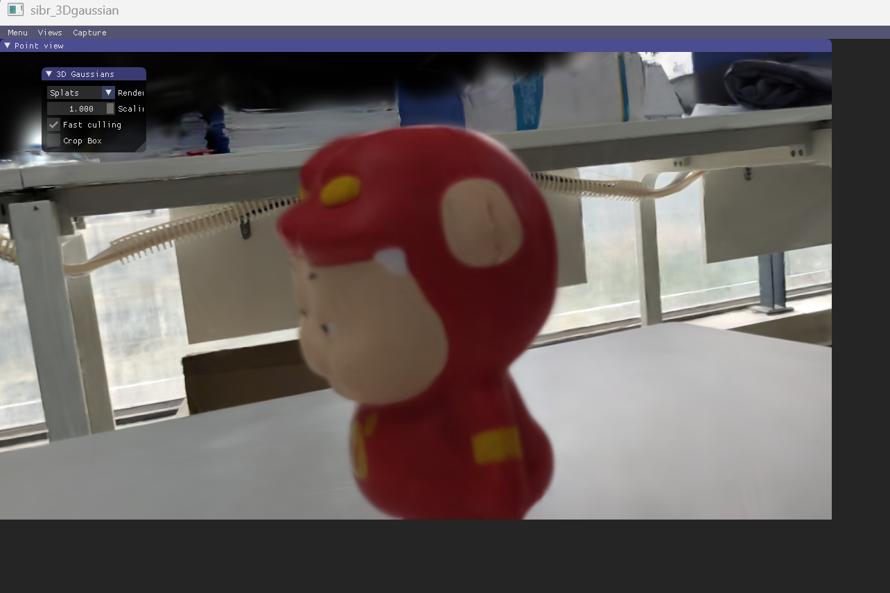
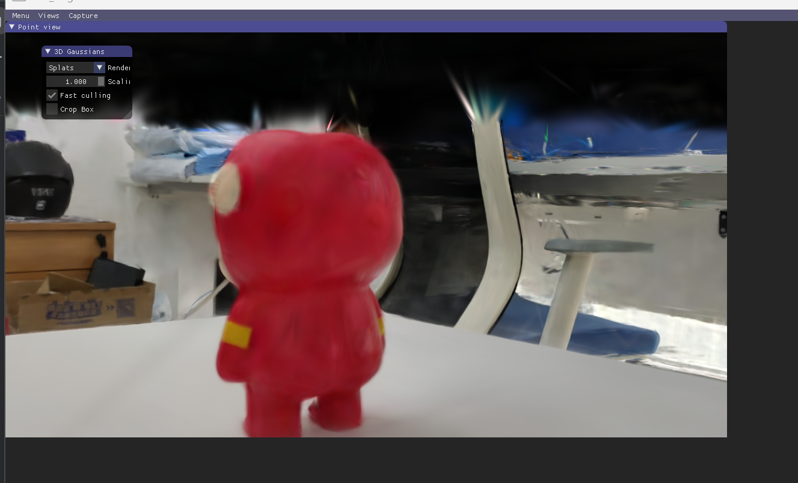
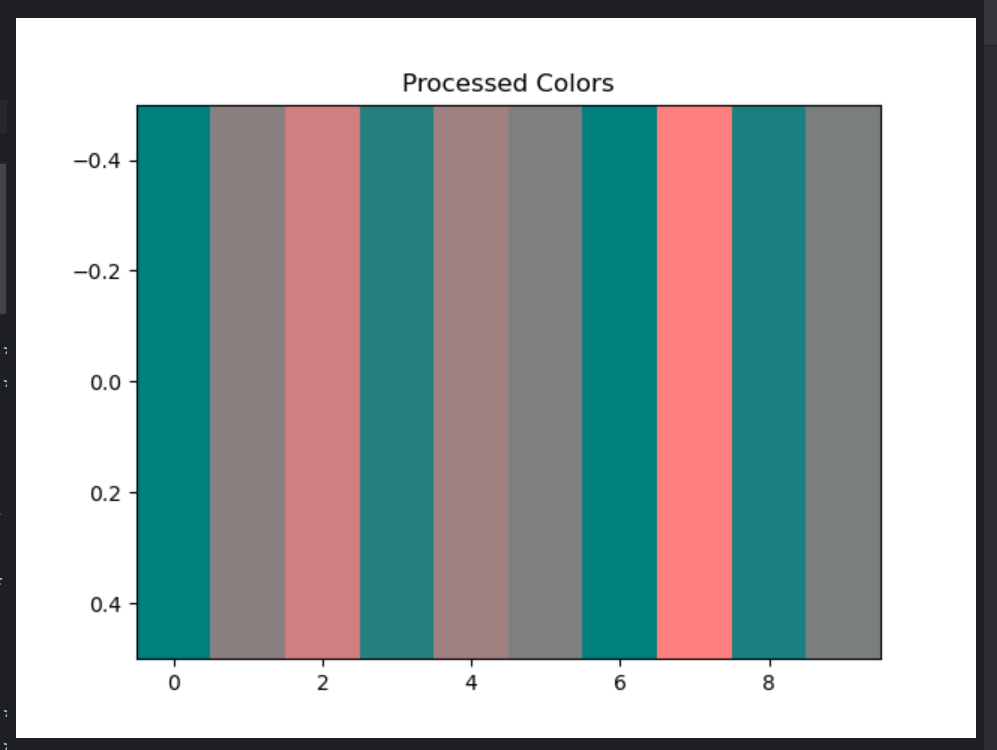

## 我的周总结

### 1. 本周完成的工作

*   实验设计与实施：

    1.运行了3DGS的代码【3D Gaussian Splatting本地部署【windows系统免环境配置-哔哩哔哩】 https://b23.tv/1D8ehfo ，效果很好
    
    
    
    2.通过代码实现了球谐函数线性组合从而计算出给定视角颜色的过程
    代码如下
```python
import torch
import numpy as np
import torch.nn as nn
import matplotlib.pyplot as plt

# 定义常量
C0 = 0.28209479177387814  # 球谐系数 C0，常见的标准值
C1 = 0.4886025119029199   # 球谐系数 C1，常见的标准值
C2 = np.array([1.0925484305920792, 1.0925484305920792, 0.31539156525252005, 1.0925484305920792, 0.5462742152960396])
C3 = np.array([0.5900435899266435, 0.31539156525252005, 0.31539156525252005, 0.5462742152960396, 0.5900435899266435, 0.5462742152960396, 1.0925484305920792])
C4 = np.array([0.31539156525252005, 0.5462742152960396, 0.31539156525252005, 0.5462742152960396, 0.31539156525252005, 1.0925484305920792])

# RGB2SH函数，将RGB转换为球谐系数
def RGB2SH(rgb):
    """
    将RGB颜色值转换为球谐系数C0项的系数。
    :param rgb: RGB颜色值。
    :return: 转换后的球谐系数C0项的系数。
    """
    return (rgb - 0.5) / C0

# eval_sh函数，用来计算球谐系数
def eval_sh(deg, sh, dirs):
    """
    Evaluate spherical harmonics at unit directions using hardcoded SH polynomials.
    Args:
        deg: int SH degree. Currently, 0-3 supported
        sh: tensor SH coeffs [..., C, (deg + 1) ** 2]
        dirs: tensor unit directions [..., 3]
    Returns:
        [..., C] RGB values
    """
    assert deg <= 4 and deg >= 0
    coeff = (deg + 1) ** 2
    assert sh.shape[-1] >= coeff

    result = C0 * sh[..., 0]
    if deg > 0:
        x, y, z = dirs[..., 0:1], dirs[..., 1:2], dirs[..., 2:3]

        result = (result -
                  C1 * y * sh[..., 1] +
                  C1 * z * sh[..., 2] -
                  C1 * x * sh[..., 3])

        if deg > 1:
            xx, yy, zz = x * x, y * y, z * z
            xy, yz, xz = x * y, y * z, x * z
            result = (result +
                      C2[0] * xy * sh[..., 4] +
                      C2[1] * yz * sh[..., 5] +
                      C2[2] * (2.0 * zz - xx - yy) * sh[..., 6] +
                      C2[3] * xz * sh[..., 7] +
                      C2[4] * (xx - yy) * sh[..., 8])

            if deg > 2:
                result = (result +
                          C3[0] * y * (3 * xx - yy) * sh[..., 9] +
                          C3[1] * xy * z * sh[..., 10] +
                          C3[2] * y * (4 * zz - xx - yy) * sh[..., 11] +
                          C3[3] * z * (2 * zz - 3 * xx - 3 * yy) * sh[..., 12] +
                          C3[4] * x * (4 * zz - xx - yy) * sh[..., 13] +
                          C3[5] * z * (xx - yy) * sh[..., 14] +
                          C3[6] * x * (xx - 3 * yy) * sh[..., 15])

                if deg > 3:
                    result = (result + C4[0] * xy * (xx - yy) * sh[..., 16] +
                              C4[1] * yz * (3 * xx - yy) * sh[..., 17] +
                              C4[2] * xy * (7 * zz - 1) * sh[..., 18] +
                              C4[3] * yz * (7 * zz - 3) * sh[..., 19] +
                              C4[4] * (zz * (35 * zz - 30) + 3) * sh[..., 20] +
                              C4[5] * xz * (7 * zz - 3) * sh[..., 21] +
                              C4[6] * (xx - yy) * (7 * zz - 1) * sh[..., 22] +
                              C4[7] * xz * (xx - 3 * yy) * sh[..., 23] +
                              C4[8] * (xx * (xx - 3 * yy) - yy * (3 * xx - yy)) * sh[..., 24])
    return result

# 假设输入的点云数据和颜色
class PCD:
    def __init__(self, colors, xyz):
        self.colors = colors
        self.xyz = xyz
        self.get_features = None
        self.get_xyz = xyz

# 假设的点云颜色数据
pcd = PCD(colors=np.random.rand(100, 3), xyz=np.random.rand(100, 3))

# 假设的视角
class ViewpointCamera:
    def __init__(self, camera_center):
        self.camera_center = camera_center

viewpoint_camera = ViewpointCamera(camera_center=torch.tensor([0.5, 0.5, 0.5]))

# 假设最大球谐阶数
max_sh_degree = 3

# 计算球谐系数并初始化特征
fused_color = RGB2SH(torch.tensor(np.asarray(pcd.colors)).float().cpu())
features = torch.zeros((fused_color.shape[0], 3, (max_sh_degree + 1) ** 2)).float().cpu()
features[:, :3, 0] = fused_color
features[:, 3:, 1:] = 0.0


# 计算SH特征

shs_view = features.transpose(1, 2).reshape(-1, 3, (max_sh_degree + 1) ** 2)

# 将pcd.xyz从numpy.ndarray转换为Tensor
pcd_xyz_tensor = torch.tensor(pcd.xyz).float().cpu()

# 进行相减操作
dir_pp = (pcd_xyz_tensor - viewpoint_camera.camera_center.repeat(pcd_xyz_tensor.shape[0], 1))

dir_pp_normalized = dir_pp / dir_pp.norm(dim=1, keepdim=True)
sh2rgb = eval_sh(max_sh_degree, shs_view, dir_pp_normalized)

# 输出处理后的结果
colors_precomp = torch.clamp_min(sh2rgb + 0.5, 0.0)

# 打印前几个处理后的颜色


# 可视化前10个颜色
plt.imshow([colors_precomp.detach().cpu().numpy()[:10]],aspect='auto')
plt.title("Processed Colors")
plt.show()

```
##### 运行结果

*   知识点学习：
    继续学习计算机图形学的基础知识；着手学习了3DGS颜色表达中的重要一环——球谐函数。为此我用matlab绘制了默认半径为1的球谐函数及其线性组合，代码如下。
```
% 设置球面参数
theta = linspace(0, pi, 100);  % 极角 [0, pi]
phi = linspace(0, 2*pi, 100);  % 方位角 [0, 2*pi]

[Theta, Phi] = meshgrid(theta, phi);  % 创建网格

% 球坐标转换为笛卡尔坐标
X = sin(Theta) .* cos(Phi);
Y = sin(Theta) .* sin(Phi);
Z = cos(Theta);

% 定义球谐函数 Y_l^m
l = 3;  % 设置阶数
m_values = [-2,-1, 0, 1];  % 不同的 m 值

% 创建一个图形
figure;

% 绘制单个球谐函数
for m = m_values
    % 计算 P_lm(cos(theta))（关联的勒让德多项式）
    t=cos(theta);
    
    P_lm = legendre(l, t);
    
   
    P_lm = squeeze(P_lm(m + 3 , :));  % 取出特定 m 值的多项式值
    
   

    % 计算球谐函数 Y_l^m
    Y_lm = sqrt((2*l + 1) / (4*pi) * factorial(l - m) / factorial(l + m)) ...
            * P_lm .* exp(1i * m * Phi);

    % 显示不同 m 值对应的球谐函数的实部
    subplot(2, 3, find(m_values == m));  % 用子图显示不同的球谐函数
    surf(X, Y, Z, real(Y_lm));  % 只绘制实部
    title(['Y_' num2str(l) '^' num2str(m)]);
    axis equal;
    colormap jet;
    shading interp;
    colorbar;
end

% 线性组合不同阶次的球谐函数（例如，取l=3, m=0和l=2, m=1的组合）


% 添加 Y_3^0 和 Y_2^1 的线性组合
l_comb = 3;  % l = 3
m_comb = 0;  % m = 0

t=cos(theta);

P_lm_comb = legendre(l_comb, t);
P_lm_comb = squeeze(P_lm_comb(m_comb + l_comb + 1, :));

Y_comb = sqrt((2*l_comb + 1) / (4*pi) * factorial(l_comb - m_comb) / factorial(l_comb + m_comb)) ...
            * P_lm_comb .* exp(1i * m_comb * Phi);

l_comb2 = 2;  % l = 2
m_comb2 = 1;  % m = 1
P_lm_comb2 = legendre(l_comb2, t);
P_lm_comb2 = squeeze(P_lm_comb2(m_comb2 + l_comb2 , :));
Y_comb2 = sqrt((2*l_comb2 + 1) / (4*pi) * factorial(l_comb2 - m_comb2) / factorial(l_comb2 + m_comb2)) ...
            * P_lm_comb2 .* exp(1i * m_comb2 * Phi);


% 线性组合
Y_combined = real(Y_comb) + real(Y_comb2);  % 实部相加

% 绘制组合效果
figure;
surf(X, Y, Z, Y_combined);
title('Linear Combination of Y_3^0 and Y_2^1');
axis equal;
colormap jet;
shading interp;
colorbar;
```
    
##### 运行结果


  


### 2. 遇到的困难和问题

* 数学基础不够，球谐函数特殊的表示方法是最大难点；
* 代码看不懂


### 3. 解决方案与已采取的措施


* 对于数学方面的知识，我在b站上学习了相关课程，对基础部分有了大致的了解
* 对于代码方面的问题，我询问了学长，并尝试着在代码的中间多添加输出模块，从而对代码中多维张量的处理有了更清晰的了解。
  
    

### 4. 下周工作计划

*   主要目标：

    *   继续学习计算机图形学课程，同时尝试学习3DGS其他部分的功能实现

*   具体任务：

    *   3DGS空间椭球的模拟以及协方差矩阵的应用

*   时间安排：

    *   每天30到40分钟。


