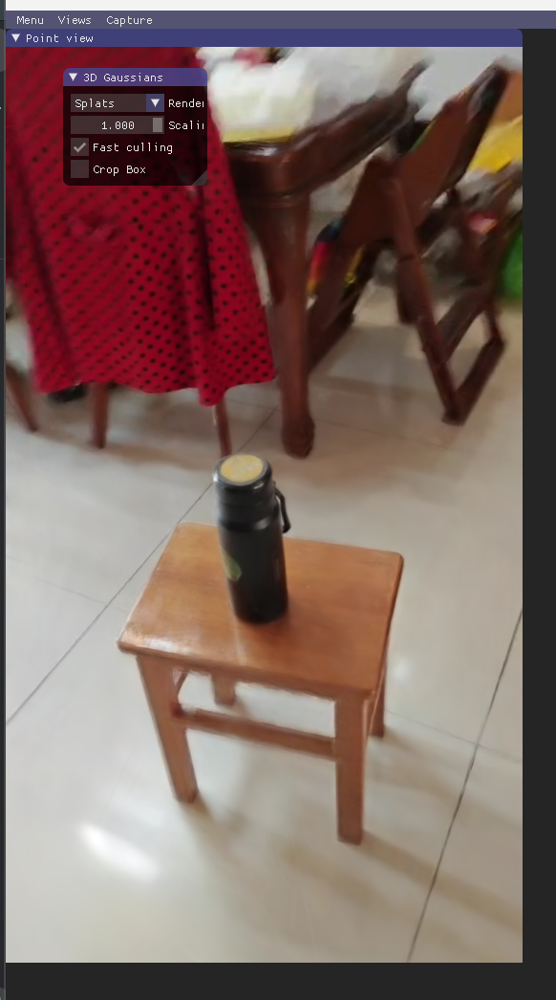
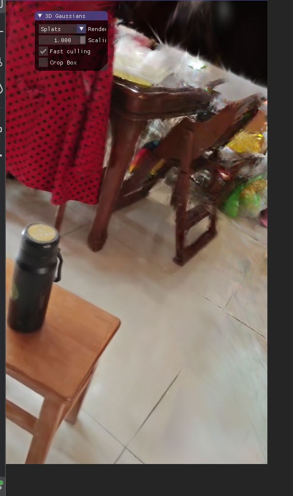
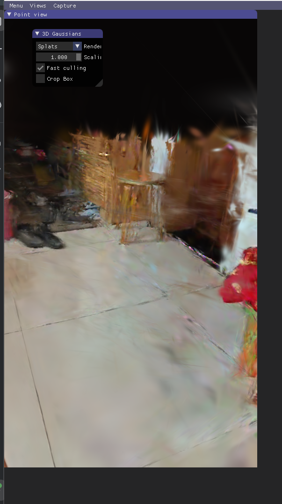
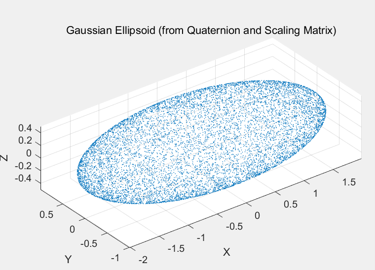

## 我的第六次总结

### 1. 本周完成的工作

*   实验设计与实施：

    *   运行了（https://github.com/jonstephens85/gaussian-splatting-Windows）
    上的代码，使用了自己的视频，效果还可以
    
    
    
*   代码学习
    * 学习了该代码库中高斯模型建立方面的代码，大致明白了主要模块的功能。
*   理论学习
    * 在之前学习了球谐函数表示颜色的基础上，我了解了协方差矩阵表示高斯椭球形状的知识点。为了将代码中通过旋转四元数和缩放矩阵得到椭球形状的过程可视化，我使用了matlab，通过散点图绘制了椭球体。
      
    

### 2. 遇到的困难和问题

*   技术难点：

    *   仓库中的cuda代码在使用pip进行编译时出现了问题，比如visual studio版本与cuda出现冲突，或是cuda版本与torch版本出现冲突。反复尝试后未能解决问题，所以我直接使用了网上现成的环境包。

*   理论疑惑：

    *   自适应密度控制生成优化高斯点的分布的方法较难理解。
    *   一些深度学习的基本操作还有些生疏。

### 3. 解决方案与已采取的措施

*   解决方法：

    *   通过认真阅读代码运行后的报错，找到问题的根源
    *   返回去阅读论文，以解决理论上的困惑

### 4. 下周工作计划

*   主要目标：

    *   进一步了解3dgs模型中深度学习的应用和自适应密度控制算法
    *   了解3dgs模型中渲染的实现

