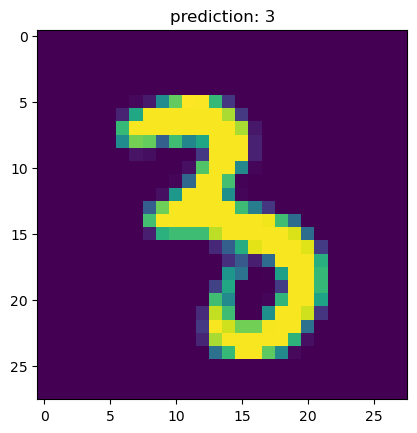
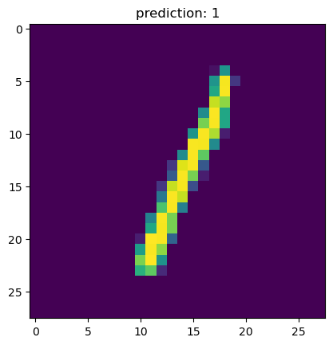
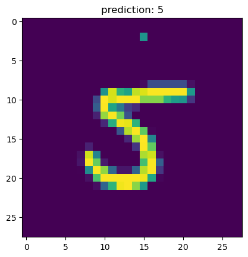

#### 我修改了上次的代码，在测试训练数据中加入了高斯噪声和高斯模糊的退化操作，但是实验结果好像与之前差不多。这里天真的我一开始以为让数据集退化只需要新建一个空列表，把原来读到的数据处理后再放进去就可以了，但这样的话好像数据集的第四维也就是批次好像就被抹除了（应该是这样吧）然后它就一直报错。后来chatgpt告诉我应该在读取数据时就可以添加这些变量。
```python
import torch
from torch.utils.data import DataLoader
from torchvision import transforms
from torchvision.datasets import MNIST
import matplotlib.pyplot as plt
from PIL import Image, ImageFilter

# 定义网络
class Net(torch.nn.Module):
    def __init__(self):
        super().__init__()
        self.fc1 = torch.nn.Linear(28 * 28, 64)
        self.fc2 = torch.nn.Linear(64, 64)
        self.fc3 = torch.nn.Linear(64, 64)
        self.fc4 = torch.nn.Linear(64, 10)

    def forward(self, x):
        x = torch.nn.functional.relu(self.fc1(x))
        x = torch.nn.functional.relu(self.fc2(x))
        x = torch.nn.functional.relu(self.fc3(x))
        x = torch.nn.functional.log_softmax(self.fc4(x), dim=1)
        return x

# 定义高斯模糊退化处理
class AddGaussianBlur:
    def __init__(self, radius=1.0):
        self.radius = radius

    def __call__(self, tensor):
        # 转换 Tensor 到 PIL.Image
        img = transforms.ToPILImage()(tensor)
        img = img.filter(ImageFilter.GaussianBlur(self.radius))
        # 转换回 Tensor
        return transforms.ToTensor()(img)

# 定义加噪声退化处理
class AddGaussianNoise:
    def __init__(self, mean=0.0, std=0.1):
        self.mean = mean
        self.std = std

    def __call__(self, tensor):
        noise = torch.randn(tensor.size()) * self.std + self.mean
        return torch.clamp(tensor + noise, 0.0, 1.0)  # 限制在 [0,1] 范围内

# 数据加载器
def get_data_loader(is_train):  # 导入数据
    if is_train:
        transform = transforms.Compose([
            transforms.ToTensor(),                      # 转为 Tensor
            AddGaussianBlur(radius=1.0),               # 添加高斯模糊
            AddGaussianNoise(mean=0.0, std=0.1)        # 添加噪声
        ])
    else:
        transform = transforms.Compose([transforms.ToTensor()])  # 仅转换为 Tensor

    dataset = MNIST("", train=is_train, transform=transform, download=True)
    return DataLoader(dataset, batch_size=15, shuffle=True)

# 评估函数
def evaluate(test_data, net):
    n_correct = 0
    n_total = 0
    with torch.no_grad():
        for (x, y) in test_data:
            outputs = net.forward(x.view(-1, 28 * 28))
            for i, output in enumerate(outputs):
                if torch.argmax(output) == y[i]:
                    n_correct += 1
                n_total += 1
    return n_correct / n_total

# 主函数
def main():
    train_data = get_data_loader(is_train=True)
    test_data = get_data_loader(is_train=False)
    net = Net()
    print("initial accuracy:", evaluate(test_data, net))
    optimizer = torch.optim.Adam(net.parameters(), lr=0.001)
    for epoch in range(2):  # epoch 表示训练数据轮次，提高数据利用率
        for (x, y) in train_data:
            net.zero_grad()
            output = net.forward(x.view(-1, 28 * 28))
            loss = torch.nn.functional.nll_loss(output, y)  # 负对数似然损失函数，用于输出为概率分布的网络
            loss.backward()
            optimizer.step()
        print("epoch", epoch, "accuracy", evaluate(test_data, net))

    for (n, (x, _)) in enumerate(test_data):
        if n > 3:
            break
        predict = torch.argmax(net.forward(x[0].view(-1, 28 * 28)))
        plt.figure(n)
        plt.imshow(x[0].view(28, 28))
        plt.title("prediction: " + str(int(predict)))
        plt.show()

if __name__ == "__main__":
    main()
```

    initial accuracy: 0.1147
    epoch 0 accuracy 0.941
    epoch 1 accuracy 0.9552
    


    

    


    

    


    

    


    

    


```python

```


```python

```
